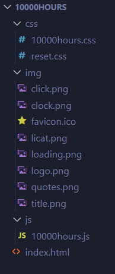
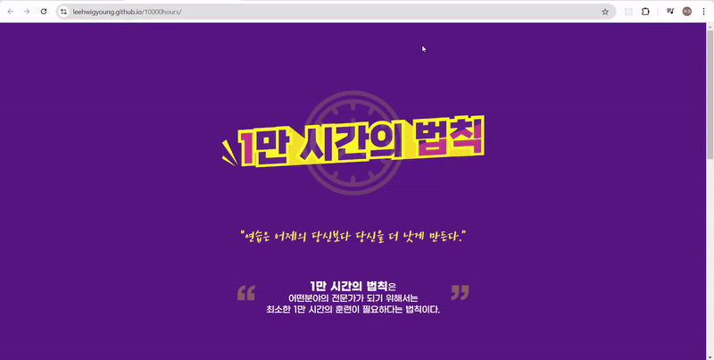

# 1만시간의 법칙
 피그마 디자인 시안을 제공받아 만든 반응형 웹 페이지입니다.

## 1. 목표와 기능
 - 모바일 페이지와 PC 페이지를 반응형 웹으로 제작한다.
 - 유저에게 하루 공부 시간을 입력 받아 1만 시간이 되려면은 며칠 걸리는지 계산해서 알려준다. (추후 JS 추가 예정)
 - "훈련 하러 가기 GO!GO!" 버튼 클릭시 모달 창이 뜨게 한다. (추후 JS 추가 예정) 
 
## 2. 사용한 기술 스택
 - HTML
 - CSS
 - JS (추후 추가 예정)
## 3. 배포 URL
- https://leehwigyoung.github.io/10000hours/
## 4. 프로젝트 구조 및 개발 일정
 ### 4.1 프로젝트 구조
 
 ### 4.2  개발 일정
 | 날짜 |  개발 내용 | 
 | :---: | :---  |
 | 24.09.03 | - PC 메인 페이지 마크업 및 반응형 CSS   - 모바일 메인 페이지 마크업 및 반응형 CSS  |
 | 24.09.05 | - 체크타임 버튼 옆 이미지 추가    - input 마진 변경 |
 | 24.09.06 | - 모달 창 마크업 및 반응형 CSS   -코드 리뷰 후 웹 접근성 및 웹 표준 고려하여 마크업 수정 |

## 5.구현 화면
### 5.1 PC 화면
- 메인 화면

- 모달 창

### 5.2 모바일 화면
- 메인 화면

- 모달 창

## 6. 개발하며 느낀점